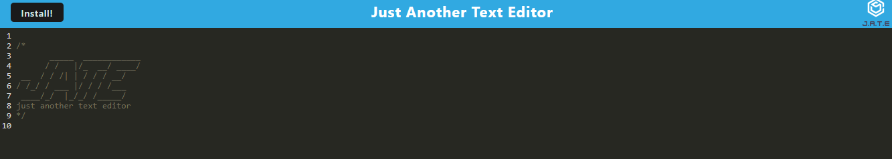

# Progressive Web Application (PWA) - Text Editor

Welcome to the Text Editor Progressive Web Application (PWA) challenge! In this project, the main task is to build an impressive text editor that runs in the browser.

## Project Overview

The text editor will be a single-page application that meets the criteria of a Progressive Web Application (PWA). It will feature offline functionality, allowing users to use the application even without an internet connection. The application will also incorporate robust data persistence techniques to ensure reliable retrieval of data.

## Table of Contents

- [Installation](#installation)
- [Usage](#usage)
- [Usage](#usage)
- [Project Links](#project-links)
- [License](#license)

## Installation

To set up the Text Editor, follow these steps:

1. Install Node.js and npm (Node Package Manager) if not already installed.
2. Clone the GitHub repository: `git clone https://github.com/Fabri-Tech/pwa-19-fabrizio-trevino.git`
3. Navigate to the project directory: `cd pwa-19-fabrizio-trevino`
4. Install the required npm packages by running the command: `npm install`

The necessary dependencies specified in the `package.json` file will be installed.

## Usage

To use the Text Editor:

1. Open the project in your preferred editor.
2. Ensure the client-server folder structure is intact.
3. Start the application by running `npm run start` from the root directory.
4. This will launch the backend and serve the client.
5. JavaScript files will be bundled using Webpack.
6. Verify that the generated HTML, service worker, and manifest files are present.

Ensure that you have the necessary dependencies installed and configured properly to enable smooth execution.

## Project links

The source code for this project can be found on GitHub in the [Repository link](https://github.com/Fabri-Tech/pwa-19-fabrizio-trevino).

The application has been deployed to Heroku, and you can access it at the following [Heroku link](https://pwa-19-fabrizio-trevino.herokuapp.com/).

## Author

Fabrizio Trevino

Email: fabriziotrevino@gmail.com

GitHub Author: fabri-tech

## License

This project is licensed under the terms of the MIT license.
